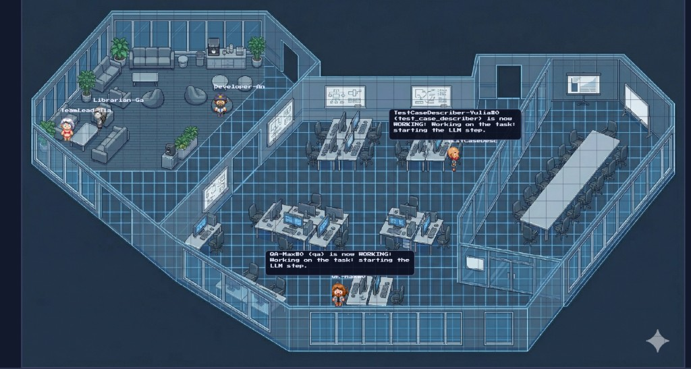

# CrewAI Office Visualizer

An on-prem visualizer that turns AI-agent events into a live office scene.



## What it is

`CrewAI Office Visualizer` is a standalone sidecar service:

- receives events via HTTP (`POST /event`);
- broadcasts updates to the UI through WebSocket (`/ws`);
- renders agent activity on a virtual office map.

## Quick start (Docker)

Requires [Docker](https://docs.docker.com/get-docker/) with Compose v2.

```bash
docker compose up -d --build
```

Or restart with rebuild:

```bash
./restart.sh
```

Open:

- UI: [http://localhost:17300](http://localhost:17300)
- API: [http://localhost:18765](http://localhost:18765)
- Swagger: [http://localhost:18765/docs](http://localhost:18765/docs)

Send a test event:

```bash
curl -sS -X POST http://127.0.0.1:18765/event \
  -H 'Content-Type: application/json' \
  -d '{"agent":"demo","action":"WORKING"}'
```

Smoke scripts:

```bash
./tests/health.sh
./tests/send_event.sh
```

## Repository layout

| Path | Purpose |
|------|---------|
| `proxy/` | FastAPI backend (event ingestion and fan-out). |
| `ui/` | React frontend (office visualization). |
| `tests/` | Bash smoke scripts (`curl`). |
| `utils/` | MCP bootstrap templates. |
| `docs/` | Detailed documentation. |

## Documentation

- Setup and run modes: [`docs/SETUP.md`](docs/SETUP.md)
- API event contract: [`docs/API.md`](docs/API.md)
- Sprite pack format: [`docs/SPRITES.md`](docs/SPRITES.md)
- Project roadmap: [`docs/ROADMAP.md`](docs/ROADMAP.md)
- MCP quick setup: [`utils/README.md`](utils/README.md)

## License

MIT - see [LICENSE](LICENSE).
